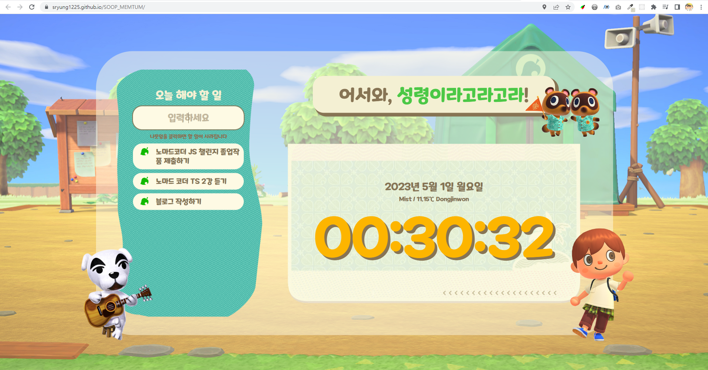

# 🏕 SOOP_MENTUM

노마드코더의 [[바닐라JS로 크롬앱 만들기](https://nomadcoders.co/javascript-for-beginners)] 강의를 수강하면서 구글 모멘텀의 기본 기능을 구현해보고 

각 기능들을 활용해서 나만의 웹페이지 "숲멘텀"을 제작했습니다.

> https://sryung1225.github.io/SOOP_MENTUM/

(권장 사용 환경 : Window10, Chrome)

---

## 🙋‍♀️ 로그인

 

### 1️⃣ 이름 입력

첫 화면에서 유저의 이름을 입력 받습니다.  
여기에서 입력된 이름은 브라우저가 계속해서 기억합니다.  
(개발자도구를 통해서 직접 이름 데이터를 지우면 해당 화면으로 돌아와 새로 이름을 입력할 수 있습니다.)

## 💁‍♀️ 대시보드

### 1️⃣ 이름 확인

로그인 화면에서 입력한 이름을 상시 노출합니다.

### 2️⃣ 현재 시간

사용자가 동작하는 현재 날짜와 시간을 노출합니다.  
시간은 초단위로 실시간 업데이트 됩니다.

### 3️⃣ 지역과 기온

사용자가 접속한 도시 이름과 해당 도시의 날씨를 노출합니다.  

### 4️⃣ 할 일 목록

사용자가 해야 할 일을 목록으로 보여줍니다.  
텍스트를 직접 입력해서 목록을 추가할 수 있고, 우측에 있는 나뭇잎 아이콘을 클릭함으로써 완료된 일을 제거할 수 있습니다.  
리스트의 수가 많을 경우, 스크롤이 생겨납니다.
